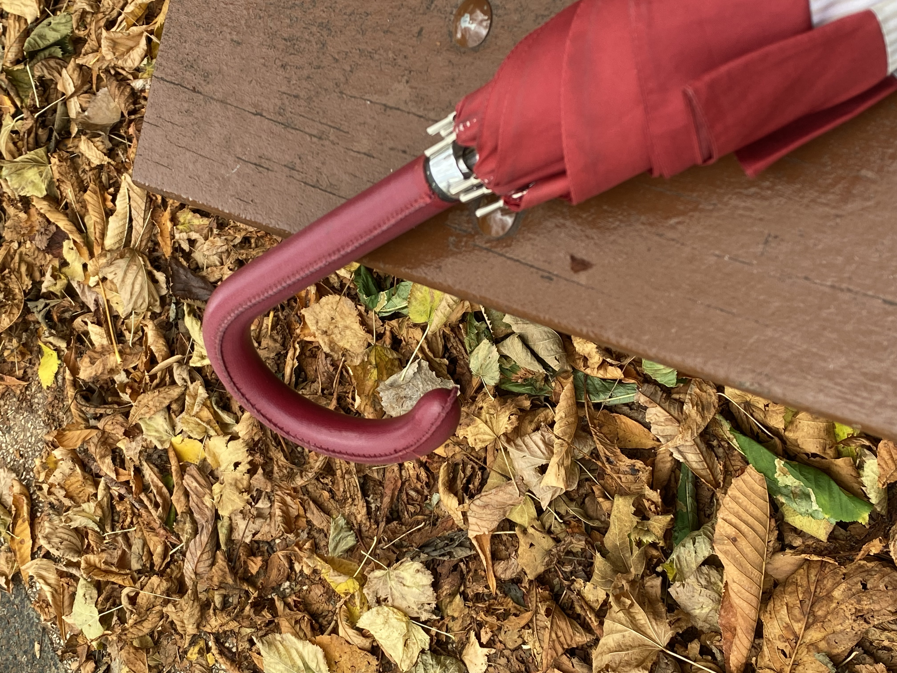

Como en Annie Hall
Me he sentado 
un ratito en un banco
Muy divertido 
ver pasar gente

Ir imaginando
Quiénes son 
los personajes 
que se cruzan en el parque

.. “ y ahí va un detective 
Siguiendo a una paloma…”

Imaginando quiénes son los otros..
..
¿ Y yo ?
¿ Quién soy yo ? 

Hago una foto 
Otoñal
y te la envío…

“… La foto del paraguas tiene algo especial,
Un implícito recuerdo,
Pero aparte de eso, que es verdad,
La foto tiene algo más..”

“Tiene implícito el ingenio del Maestro
siempre auto reflexivo y mordaz... 
Lanzando una mirada compasiva 
sobre los personajes,
a pesar de criticarlos 
y ponerlos en situaciones dificiles... Supongo que, nos guste o no, tenemos mucho en común con él...”

“La foto del paraguas 
tiene algo especial…
Algún mensaje oculto…
Otra forma de hacer poesía 
de lo cotidiano”

